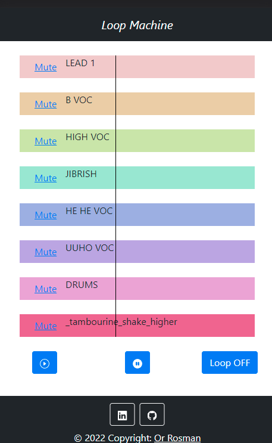

# Loop Machine

---

## Deployment

[Loop Machine - Or Rosman](https://orrosman.github.io/Loop-Machine/)

## 

## Description

An app that lets you play around with different sounds🎶

---

## Features
- 📱 Mobile friendly
- 🔇 Toggle which tracks will be played with a mute button
- 📈 A cursor to show you the progress of the tracks
- ⏯ Play/Pause buttons
- ➿ A "Loop" button - loop through the track and hear them again and again...

---

## Build with:

- [⚛ React](https://reactjs.org/)
  - [🏗⚛ Create React App](https://github.com/facebook/create-react-app)
- [👢Bootstrap](https://getbootstrap.com/)
  - [React-Bootstrap](https://react-bootstrap.github.io/)
